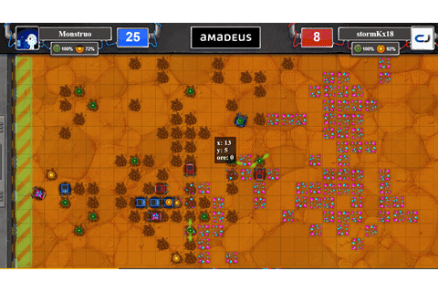

# 🤓 Unleash the geek

### Codingame.com contest - Oct 4 to14, 2019

This is the code I developed during the contest [**Unleash the geek**](https://www.codingame.com/contests/unleash-the-geek-amadeus) at [Codingame](http://www.codingame.com/), during 10 days of coding. I used Ruby mainly because currently, I'm still learning the language while participating in the [Microverse](http://www.microverse.org/) training program.

And yes, also because I like it. 😃

## 📈 [Ruby leaderboard](https://www.codingame.com/leaderboards/contests/unleash-the-geek-amadeus/global?column=language&value=Ruby)

## 👨‍💻 The code

Although the game is no longer available for playing, this code can be interesting for someone learning about AI's. I don't consider myself a great reference, but I'm releasing this hoping this code can be useful for someone.

If you have any questions about it, please feel free to drop me a line at [oscar@oscarnava.me](mailto:oscar@oscarnava.me).

---
## 🛠 Built with:
- Ruby
- ☕ Coffee of course!

## 👤 Contributors

- [Oscar Nava](https://github.com/oscarnava) 📧 contact@oscarnava.me

## 🗝 License
Creative Commons [Attribution 4.0 International (CC BY 4.0)](https://creativecommons.org/licenses/by/4.0/).

---
## 👨‍🏫 Main points to consider:

* Because of the nature of the platform, all code is concentrated in one single file; not ideal, but required.
* All the design is separated in classes, being **GameState** the main class.
* Only one instance of **GameState** exists, and each turn it's updated and asked for the next moves.
* Entities like *Robots*, *Traps*, and *Radars* all derive from the parent class **Entity**, and robot strategies derive from the class **Task**.
* Each robot is assigned a task, which will depend on the current state of the game.
* When finished a task, robots are assigned another one depending on its current state.
* Radar positions are fixed trying to maximize the area covered and the probability of being in the range of an ore vein.
* The class **Command** is private to GameState so that the later can be updated every time a robot computes the command it will issue.
* When created, a **Position**'s row and column will be coerced to be laid within the board.
* Each **Cell** instance contains the current state of the corresponding cell on the board, even some guessed features like *"Is it dangerous? (probable enemy trap)"* or *"Was it dug just now?"*

## Game rules

Amadeusium is a rare and valuable crystal ore which is only found on inhospitable planets. As one of two competing mining companies, you must control the robots on-site to unearth as much ore as you can.

Deliver more Amadeusium than your opponent!

#### Rules

Both players control a team of several robots. The teams start out at the same points on the map, at the headquarters. The robots can use radars from the headquarters to detect and mine Amadeusium veins. They may also trap certain areas of the map with EMP traps. These can be triggered by robots which are then rendered inoperable.

#### The map

The game is played on a grid 30 cells wide by 15 cells high. The coordinates x=0, y=0 corresponds to the top left cell.

The first column of cells is considered to be part of the headquarters. This is where Amadeusium ore must be returned to once mined and where objects are requested.

The cells that contain Amadeusium ore are called vein cells. Veins are not visible to the players unless they are within the range of the player's radar. There are no vein cells in the headquarters.

Robots can drill a hole on any cell (except the headquarters'). Holes are visible to both players and do not impede movement.

#### Robots

Each robot can hold 1 item in its inventory.

A robot may:

REQUEST an item from the headquarters.
MOVE towards a given cell.
DIG on a cell. This will, in order:
Create a hole on this cell if there isn't one already.
Bury any item the robot is holding into the hole.
If digging on a vein cell and ore was not buried on step 2, place one unit of ore into the robot's inventory.
WAIT to do nothing.
Details:

Robots may only dig on the cell they occupy or neighbouring cells. Cells have 4 neighbours: up, left, right, and down.
Robots on any cell part of the headquarters will automatically deliver any ore it is holding.
Robots can occupy the same cell.
Robots cannot leave the grid.
Robots' inventories are not visible to the opponent.
Items

Amadeusium Ore is considered an item and should be delivered to the headquarters to score 1 point.

At the headquarters, robots may request one of two possible items: a RADAR or a TRAP.

If an item is taken from the headquarters, that item will no longer be available for the robots of the same team for 5 turns.

A trap buried inside a hole will go off if any robot uses the DIG command on the cell it is buried in. The EMP pulse destroys any robots on the cell or on the 4 neighbouring cells. Any other trap caught in the pulse will also go off, causing a chain reaction.

A radar buried inside a hole will grant the ability to see the amount of buried ore in veins within a range of 4 cells, for the team which buried it. If an opponent robot uses the DIG on the cell the radar is buried in, the radar is destroyed.

You can check out the source code of this game on [this GitHub repo](https://github.com/CodinGameCommunity/UnleashTheGeek).

## 📡 Contact

Please don't hesitate to contact me at 📧 [contact@oscarnava.me](mailto:contact@oscarnava.me) if you have any questions, comments, etc. I would love to know what's on your mind!
